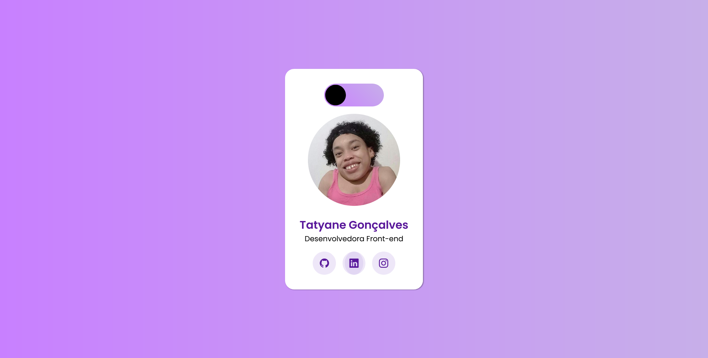

<h1 align="center"> Cartão de Usuário - Modo escuro e claro </h1>
    

        <a href="#-tecnologias">Tecnologias</a> &nbsp;&nbsp;&nbsp;|&nbsp;&nbsp;&nbsp;
        <a href="#-projeto">Projeto</a> &nbsp;&nbsp;&nbsp;|&nbsp;&nbsp;&nbsp;
    

 

## 🚀 Tecnologias

Esse repositório contém essas tais tecnologias :

- HTML
- CSS
- JavaScript

## 💻 Projeto

Neste projeto fiz um card para colocar em prática meus conhecimentos aprendido em JavaScript

## 🖼️ Layout

Feito com ♥ by Tatyane Gonçalves :wave: 

